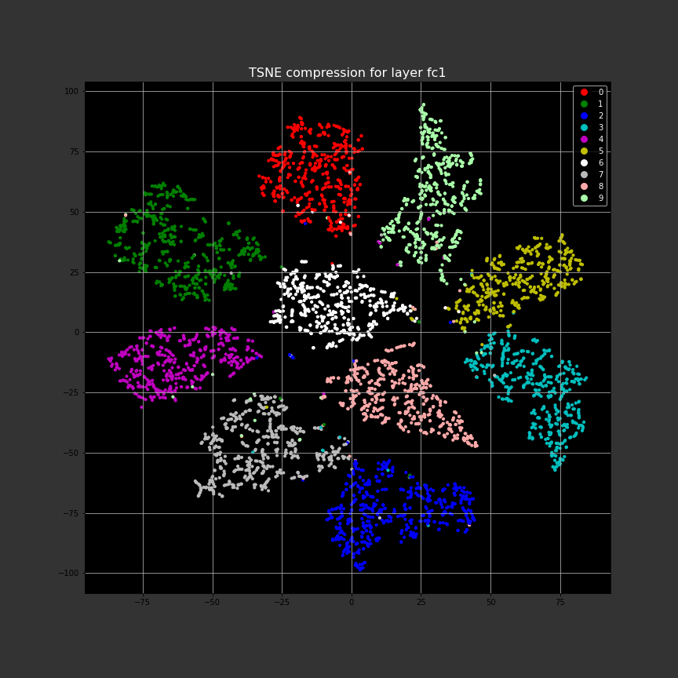

# deep-learning-examples
### Various examples in deep learning

## Example of overfitting using a two-layer neural network, from overfit_demo.ipynb:

## Example of clustering in the fc1 layer of the MNIST network defined in pytorch_mnist.ipynb.
### This is a 50-dimensional embedding space reduced to 2 dimensions by TSNE for plotting purposes. 
### This network achieves 98% accuracy.

