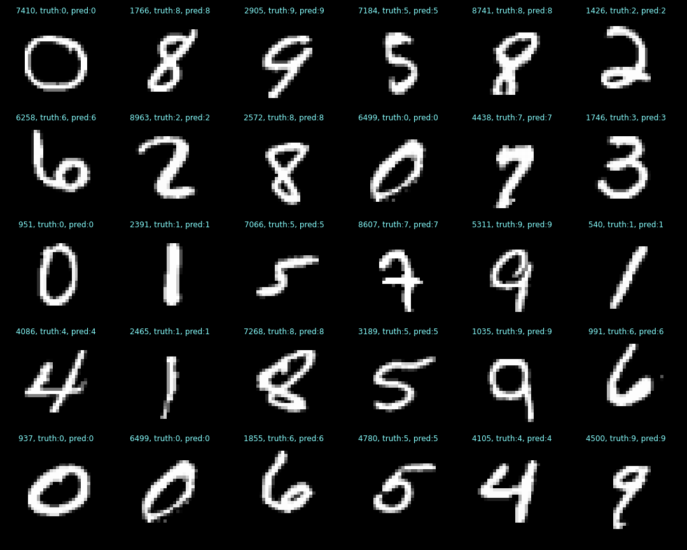

# deep-learning-examples
### Various examples in deep learning

# OVERFITTING
## Example of overfitting using a two-layer neural network, from overfit_demo.ipynb:

# MNIST
## Example of clustering in the fc1 layer of the MNIST network defined in pytorch_mnist.ipynb.
### This is a 50-dimensional embedding space reduced to 2 dimensions by TSNE for plotting purposes. 
### This network achieves 98% accuracy.

## Confusion matrices of training and testing data, respectively. 
### The row is the digit truth, the column is the digit prediction. 
### The accuracy is the sum of the diagonals divided by the total number of cases.
### In this case, the test confusion is slightly better than the train confusion.

## Example digits that have been correctly classified:

## Example digits that have been incorrectly classified:

